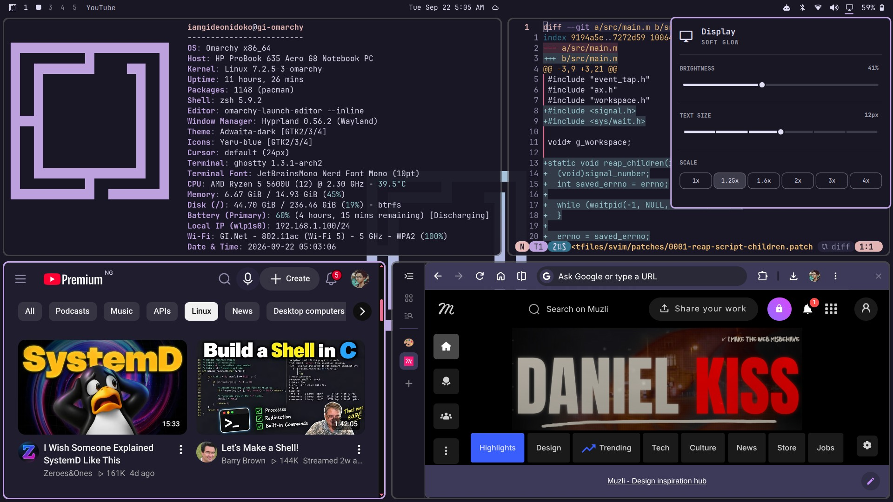

# dotfiles

Personal dotfiles for a seamless macOS and Omarchy workspace built for focused,
high-leverage work.

## Clone

```sh
git clone git@github.com:iamgideonidoko/dotfiles.git ~/dotfiles
cd ~/dotfiles
```

## macOS


```sh
make macos-setup
```

## Omarchy



```sh
make omarchy-setup
```
