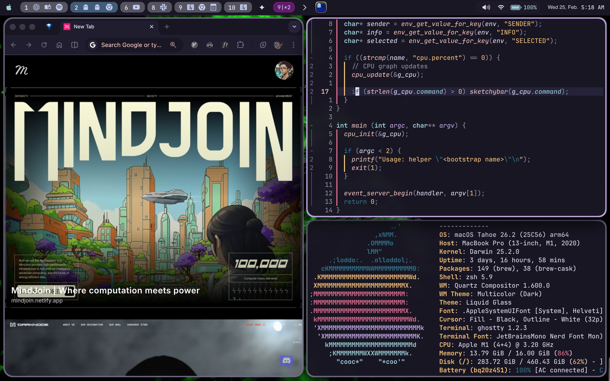

# dotfiles



## Setup

Follow the below steps to set up in a few seconds.

### Clone dotfiles

Clone this repository into `~/dotfiles`, then run these commands from that directory.

### Install Software

Install Homebrew if needed, then all software listed in the `Brewfile`:

```sh
make brew-install
```

### Create Symlink

Create a symlink to the necessary configuration files and directories:

```sh
make symlink
```

### Install Runtime Versions

Install pinned Node, Python, Go, and Rust versions through Mise.

```sh
make mise
```

### Install GitHub Extensions

```sh
make gh-extensions
```

### Open Zsh

```sh
make shell
```

### Install Nerd Font

Download and install JetBrainsMono Nerd Font:

```sh
make font-jetbrains
```

### Configure macOS

Apply the macOS preferences used by this setup. This enables shared Spaces across
displays, so change `spans-displays` to `false` in [`macos.sh`](./macos.sh) if
you use multiple monitors with separate Spaces.

```sh
make macos
```

For monitor placement, follow the [AeroSpace monitor arrangement guide](https://nikitabobko.github.io/AeroSpace/guide#proper-monitor-arrangement).

### Configurations for SketchyVim

1. Build and start patched service. Do not manage `svim` through Homebrew's
   service; its v1.0.11 binary leaks exited `svim.sh` children on macOS.

   ```sh
   make svim-activate
   ```

2. Verify after normal typing for one minute:

   ```sh
   make svim-verify
   ```

### Configurations for Sketchybar

```sh
make sketchybar
```

### Configure Spotify Theme

Open Spotify, sign in, and leave it open for one minute. Then run:

```sh
make spicetify
```

### Provide Permissions

Open the software the require additional permissions and grant them. Also add the software like Scoot that should be login items.

<br />

Done! 😎
