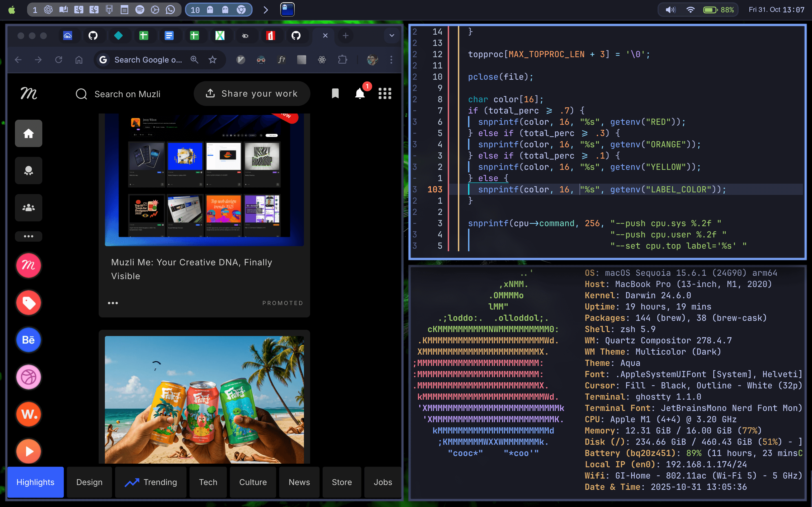

# dotfiles

My config for Neovim, Tmux, SketchyVim, etc.



## `nvim`

## `svim`

## `tmux`

### Prequisites

Tmux Package Manager (TPM):

```sh
git clone https://github.com/tmux-plugins/tpm ~/.tmux/plugins/tpm
```
